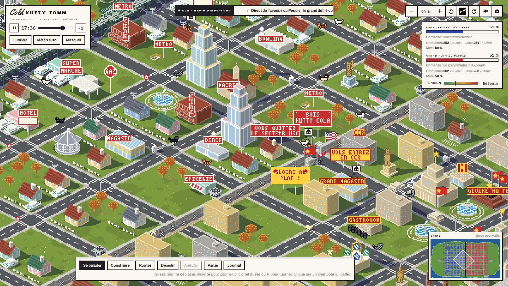
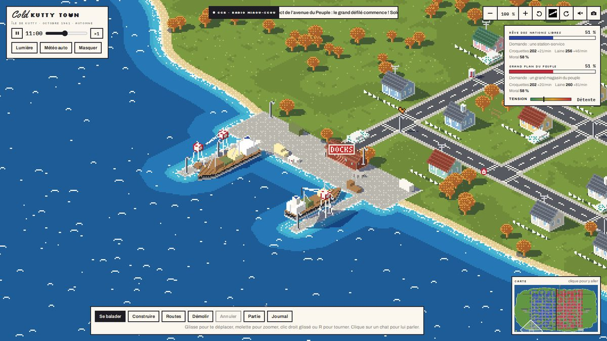
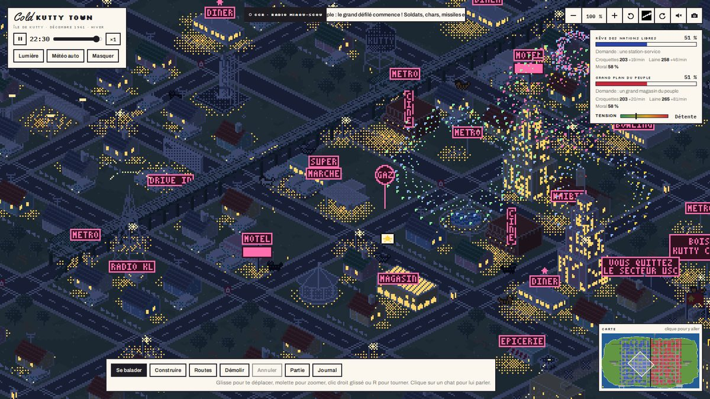
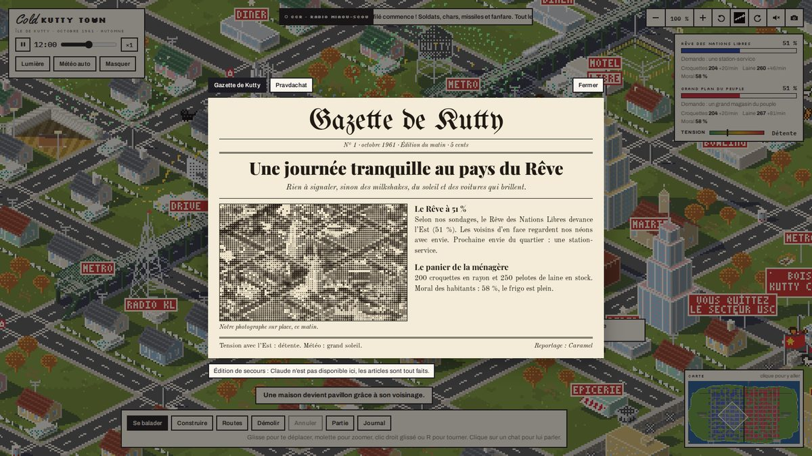
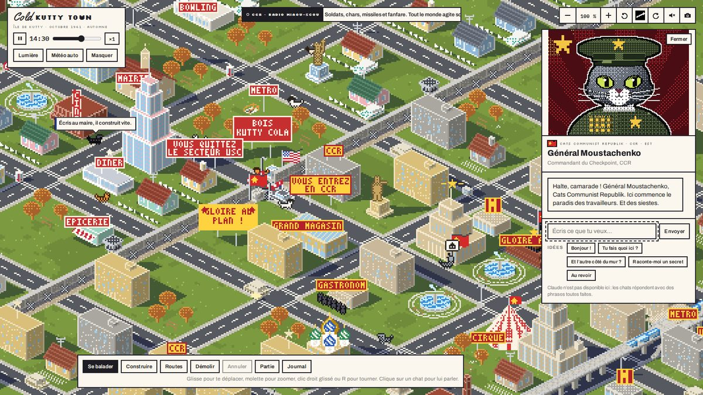

<p align="center"></p>

# Cold Kutty Town

Un city builder de chats pendant la guerre froide. En couleur, du matin à la nuit.

Une île vierge, deux camps : les United Sands of Cats (USC) et la Cats Communist Republic (CCR). Tu choisis ton camp et ta plage, tes barges accostent, et tu bâtis ta ville : routes droites ou courbes, maisons, pêcheries, bergeries, port qui devient grand port. Chaque bâtiment fait grandir ton territoire, bleu ou rouge, en direct sur la carte. Croquettes pour manger, laine pour bâtir, ronrons pour conquérir. Le premier camp à tenir 60 % de l’île gagne.

**Jouer en ligne :** (lien Vercel à venir)

## Lancer le jeu sur ton ordi

Il faut Node.js 20.19 ou plus récent.

```bash
git clone https://github.com/lhemwii/cold-kutty-town.git
cd cold-kutty-town
npm install
npm run dev
```

Ouvre http://localhost:5173. Chaque fois que tu enregistres un fichier dans `src/`, le jeu se reconstruit et la page se recharge toute seule.

Pour l’instant, les chats et le journal utilisent des textes tout faits : aucune clé n’est nécessaire.

## Construire et déployer

```bash
npm run build      # écrit le site dans dist/
npm run preview    # sert dist/ sur http://localhost:4173
```

Le dépôt est relié à Vercel : chaque push sur `main` part en production, chaque autre branche donne une préversion avec sa propre adresse. Pour Claude en ligne, ajoute `ANTHROPIC_API_KEY` dans les variables d’environnement du projet Vercel.

## Comment c’est fait

Du JavaScript en modules ES, qui passe module par module en TypeScript, construit avec Vite, rendu pixel par pixel dans un canvas. La suite prévue : PixiJS pour le rendu en haute définition, Electron pour Steam (voir le plan, étape 0.19). Le moteur isométrique est écrit à la main : buffers de pixels, palette jour et nuit, tri des objets par profondeur, lumières, ombres. Pas d’image : chaque bâtiment, chat, voiture et avion est dessiné par du code.

```
src/
  index.html            la page (panneaux, fenêtres, dock)
  styles/main.css       le style de l’interface
  main.ts               point d’entrée : charge les modules dans l’ordre
  game/00-shared.ts     état partagé entre modules (SH) et types communs
  game/01-core.ts ...   le jeu, en modules ES chargés dans l’ordre de leur numéro
  platform/standalone.ts  branche Claude et les téléchargements hors de claude.ai
  gpu/present.ts        affichage par PixiJS : mise en couleur de l’image sur la carte graphique
api/claude.js           fonction Vercel qui relaie vers l’API Claude
vite.config.js          build, serveur local et /api/claude en local
docs/                   architecture, règles du jeu, développement, feuille de route
```

## Documentation

- [Document produit (PRD)](docs/PRD.md)
- [Plan d’implémentation et choses à faire](docs/PLAN.md)
- [Architecture du moteur](docs/ARCHITECTURE.md)
- [Règles du jeu](docs/GAMEPLAY.md)
- [Développer au quotidien](docs/DEVELOPPEMENT.md)

## Images

<p> </p>
<p> </p>

Un projet de Wilhem Godeau, codé avec Claude.
